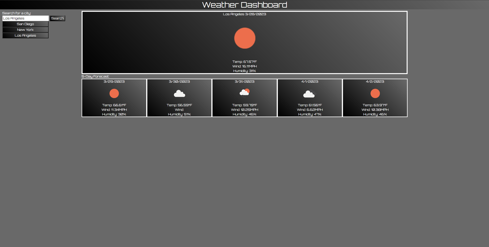

# Weather-Application

## Description
Link to live app: https://eldenbear.github.io/Weather-Application/

This project is a simple weather application that takes input from the user and displays the weather for the current day as well as a 5-day forecast.
It uses the openweathermap API to get the information to the user.

## Usage
Screenshot of app:

## Credits

Weather API provided by: https://openweathermap.org/

